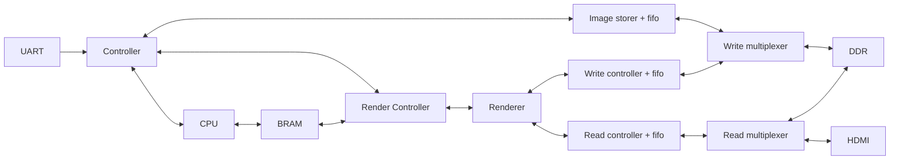

# SoC Graphics Accelerator & 32-bit Custom CPU
- a render engine in fpga board
- have these part: uart, cpu, BRAM, controller, DDR, render engine, image storer, and HDMI interface
	- cpu: calculation
	- BRAM: program and variable
	- controller: top level control & data flow manager
	- render engine: render
	- DDR: image and each pixel in the screen
	- image storer: reverse & store image
	- HDMI interface: as name said
- cpu talk to BRAM and render engine
- render engine talk to DDR and read from BRAM

## High-level component


- multiplexer switch based on who want to write or read

## Controller
- handle top-level controlling
- state
	- loading : loading program, only enter this stage after wake up or reset
		- pass the data directly to cpu, let cpu write ram by it's own
		- if EOF is reached, set bin_load to 1 and send this signal to cpu
	- var_loading : loading image and var, wait for image controller to send back signal "ok" to continue, external interrupt will be ignore in this stage
	- render_static : render static image, wait for RAM and render engine, no external interrupt
	- run : enter control flow
	- wait_vsync : halt the cpu until next rising vsync signal is receive
	- wait_input : halt the cpu until next input is the target input
	- halt : stop the cpu
- handle uart and button interrupt (fake interrupt tho)
	- is a dirty (force) jump with no jump back, since this language contain no pinter stack, this is intended design
	- work by checking input byte, if found, set interrupt flag and interrupt PC
	- store directly inside controller (INPUT asm will tell how to store)
	- can store up to 16 interrupt
- have an INTER_FLAG, INTER_PC and CPU_HALT command
	- 6 special function (RENDER, HALT, IMG, WAIT, RENDER_STATIC, NEW_INTER) will halt the cpu
	- each function have it's own behavior
		- HALT: wait for any interrupt, PC is that interrupt PC
		- IMG: wait for render engine to finished. PC is next command, can't change
		- RENDER_STATIC: wait for render engine to finished. PC is next command, can't change
		- WAIT: wait for any interrupt, if the correct interrupt is present, go to next PC, otherwise go to whatever PC of interrupt
		- RENDER: wait for vsync signal, PC is next command
		- NEW_INTER: wait until write register inside cnotroller is finished, go to next PC

### flow of the state
- power up -> loading
- after program is loaded (end with EOF) -> turn on the cpu and wait for img()
- if cpu call IMG the first time -> go to var_loading
- the first time the RENDER_STATIC is called -> go to render_static
- immediately after render finished -> go to run
- if RENDER is called, go to wait_vsync. If WAIT is called, go to wait_input
- if HALT is called, go to halt

## CPU
### general
- 32 bit architect, 4 bit opcode
- 16 4-byte register (R0 - R15)
- multi-stage cpu
- have PC register
- no call stack
- variable position is static
- no delete or allocate new variable while running
- BRAM as storage for variable and program

### behavior
- only + and - for archithematic operation
- general comparision operation
- no array, every memory is direct access
- have this control flow: if, else, while, break
- no function call except special function

### state
- is a general multi-stage cpu
- state
	- load: execute at power up, load until flag "bin_loaded" is aqquired
	- fetch: fetch instruction from pc and checking for interrupt flag
		- if interrupt is present, go to that PC instantly
	- decode: decode
		- directly go to halt state and send halting signal if special function is present
		- jump command execute here
	- execute: execute command
	- writeback: as name said
	- halt: stop here until the "halt" signal is zero

## Program
### ISA
- big endian
- 4 bytes
	- 31-28: opcode
	- 27-24: dest register (r_dest)
	- 23-20: source register or condition code (r_src)
	- 19-16: reserve
	- 15-0: immediate, mem address
- list

| Opcode | Mnemonic | Operands       | Description                                            |
|--------|----------|----------------|--------------------------------------------------------|
|   0000 | NOOP     | -              | Do nothing.                                            |
|   0001 | LDI      | r_dest, IMM24  | Load 24-bit immediate (bits 23-0) into r_dest.         |
|   0010 | LD       | r_dest, ADDR16 | Load data from BRAM at ADDR16 into r_dest.             |
|   0011 | ST       | r_src, ADDR16  | Store data from r_src into BRAM at ADDR16.             |
|   0100 | MOV      | r_dest, r_src  | Copy value from r_src to r_dest.                       |
|   0101 | ADD      | r_dest, r_src  | Addition: r_dest = r_dest + r_src.                     |
|   0110 | SUB      | r_dest, r_src  | Subtraction: r_dest = r_dest - r_src.                  |
|   0111 | AND      | r_dest, r_src  | Bitwise AND: r_dest = r_dest & r_src.                  |
|   1000 | OR       | r_dest, r_src  | Bitwise OR: r_dest = r_dest \| r_src.                  |
|   1001 | JMP      | ADDR16         | Unconditional jump to ADDR16.                          |
|   1010 | CMP      | r_dest, r_src  | Compare r_dest vs r_src; store result in hidden flags. |
|   1011 | BEQ      | ADDR16         | Branch to ADDR16 if CMP result is Equal.               |
|   1100 | BGT      | ADDR16         | Branch to ADDR16 if CMP result is Greater Than.        |
|   1101 | BLT      | ADDR16         | Branch to ADDR16 if CMP result is Less Than.           |
|   1110 | CALL     | type, data     | Call special function.                                 |         |

- for CALL, there's 5 possible function
	- IMG (0000) : make controller load image
		- bit 23-14	: h0 position  
		- bit 13-5	: v0 position
		- bit 4-0 : image pointer
	- RENDER (0001) : render dynamic layer
	- WAIT (0002) : signal controller to wait for input
		- bit 7-0 contain input
		- input can be a-z, A-Z, or physical button (0xFF)
	- RENDER_STATIC (0003) : signal controller to render static layer
	- HALT (0004) : halt program
	- NEW_INTER (0005) : create new interrupt input
		- bit 23-16: character
		- bit 15-0: jump address

### lark defination
```
start: block* statement*

    // --- Declarations ---
    block: NAME "{" assignment* "}"
    assignment: NAME "=" value

    value: NUMBER                  -> val_num
         | NAME                    -> val_var
         | SQ_STRING               -> val_char  // NEW: Handle 'w' or '*'
         | constructor
         | "[" list_items "]"      -> val_list

    constructor: NAME "(" args ")"
    args: arg ("," arg)*
    arg: expression                -> arg_pos
       | NAME "=" expression       -> arg_named

    list_items: expression ("," expression)*

    // --- Logic & Control Flow ---
    code_block: "{" statement* "}"

    statement: "label" NAME                             -> label_stmt
             | "while" "(" condition ")" code_block     -> while_stmt
             | "break"                                  -> break_stmt
             | "if" "(" condition ")" code_block ("else" code_block)? -> if_stmt
             | NAME "." NAME "=" expression             -> prop_set
             | NAME "=" expression                      -> var_set
             | NAME "(" [args] ")"                      -> call_stmt  // CHANGED: Added [args]

    // --- Expressions ---
    condition: expression GEN_CMP expression -> binary_op
    
    expression: term (GEN_OP term)*
    term: value | "(" expression ")"

    GEN_CMP: ">" | "<" | "==" | "!=" | ">=" | "<="
    GEN_OP: "+" | "-"
    
    SQ_STRING: "'" /[^']+/ "'"   // NEW: Regex for single quoted string
    
    %import common.CNAME -> NAME
    %import common.INT -> NUMBER
    %import common.WS
    %import common.CPP_COMMENT
    %ignore WS
    %ignore CPP_COMMENT
```

### example
```
image {
		// define image like this
		// h0 and v0 or image will be the topleft position
		// name = Asset(h0, v0)
    background_img = Asset(0, 0)
    img1 = Asset(100, 100)
}

control {
		// associate 'w' with START
		// when interrupt 'w' is in, go to label START
    w = START
    r = END
}

int {
    h = 700
    delta_h = 1
}

static {
		// define shape like this
    // name = Rect(h0, v0, h1, v1, others)
    // name = Tri(h0, v0, h1, v1, anchor=,others)
		// h0, v0 is topleft boundary
		// h1, v1 is bot-right boundary
    background = Rect(0, 0, 768, 1024, img=background_img)
    up_rect    = Rect(0, 0, 768, 1024, color=[r,g,b])
}

dynamic {
    player  = Tri(0, 0, 768, 1024, anchor=top_left, color=[r,g,b])
    player2 = Tri(0, 0, 768, 1024, anchor=top_left, color=[r,g,b])
    
    // Keywords like 'transparent' become specific flags
    trans   = Rect(0, 0, 768, 1024, flags=[transparent])
}

label START

player.h0 = 700
player2.h0 = 700
render()
wait_for_button('w')

while (h > 400) {
    h = h - delta_h
    if (h < 500) {
        player2.h0 = h
    } else {
        player.h0 = h
				break
    }
    render()
}

// mean "wait for on board button"
wait_for_button('*')
label END
halt()
```

### variable type
- have 3 variable type: int (4 byte), shape (12 byte), image (4 byte, which is pointer point to image in ddr)
- int is unsinged int ONLY
- the "shape" have these properties
	- type (1 bit): 0 is rectangle, 1 is triangle (right triangle)
	- anchor (2 bit): for triangle only, state where's the right angle of triangle is
		- 00 for top-left
		- 01 for top-right
		- 10 for bot-left
		- 11 for bot-right
	- mode (2 bit): define how to render, each image can have only 1 mode at a time
		- 00 for color
		- 01 for image overlay
		- 10 for transparent
	- enable (1 bit): 1 for render, 0 for not
	- h0 (4 byte): top left x coordinate
	- v0 (4 byte): top left y coordinate
	- h1 (4 byte): bot right x coordinate
	- v1 (4 byte): bot right y coordinate
	- red (1 byte): color red
	- green (1 byte): color green
	- blue (1 byte): color blue
	- image pointer (8 bit): where's the image is, only valid for mode 01
	- static (not store in memory): define if the shape is the baackground or not (0 for static)
- the "image" only need to contain pointer to image. No need to interact with it beside
	- allocate the starting position in DDR
	- associate image with certain shape
	- other component will interact with it (store, render) after the program is loaded


## BRAM structure
- 4 byte wide
- every component is static
- from top to bottom
	- Program (512 word): contain all program, end with EOF (maybe)
	- Integer (64 word)
	- Static Shape Count (1 word): number of static shape in the program, nessesary for render engine
	- Dynamic Shape Count (1 word): number of dynamic shape in the program, nessesary for render engine 
	- Shape Flag (32 word): the flag of each shape, which is (order from bit 31 to 0)
		- bit 31: type
		- bit 30-29: anchor
		- bit 28-27: mode
		- bit 26 : disable
		- bit 25-24: nothing (reserved)
		- bit 23-0: depend on if shape is image or color
			- for color: store RGB from 23-16
			- for image: store img pointer from 23-0
	- Shape h0 (32 word)
	- Shape v0 (32 word)
	- Shape h1 (32 word)
	- Shape v1 (32 word)

## Image storer
- store image (Bitmap) in a correct resolution, position, and address
- receive data directly from controller
- trigger by send image write request + all the data component
- have one fifo inbetween controller and write arbiter
- will only execute at the var_loading state in controller

## Render engine
- contain 2 component: render controller, renderer
- render controller
	- receive signal from controller
	- read data from RAM if cpu tell to do
	- send "how and where to render" to renderer
- renderer
	- receive data from render controller
	- render shape
	- generate read & write req to DDR
	- block render controller until it's finished
	- have 2 fifo for read from DDR and write to DDR

## DDR structure
- 16 * 64 bit request size for both read and write
- is 512 word 4 byte (28 bit address)
- divide this DDR into block of 8MiB, each block contain an entire image of 1024*768*4 byte
	- bit 28-22 address
	- bit 21-0 store actual value
- from top to bot
	- Static background (0x00) : the combination of render of static shape
	- Current frame buffer 1 (0x01): the combination of static background and dynamic render, buffer 1
	- Current frame buffer 2 (0x02): the combination of static background and dynamic render, buffer 2
	- Image (0x03 to 0x7F): image, all sizes 768*1024*4 byte
- all the module connect to DDR need to pass a arbiter, both read and write

## HDMI
- use the ping pong stradegy on buffer 1 (0x01) and buffer 2 (0x02)
	- if renderer finished AND vsync reach, swapped, otherwise not

